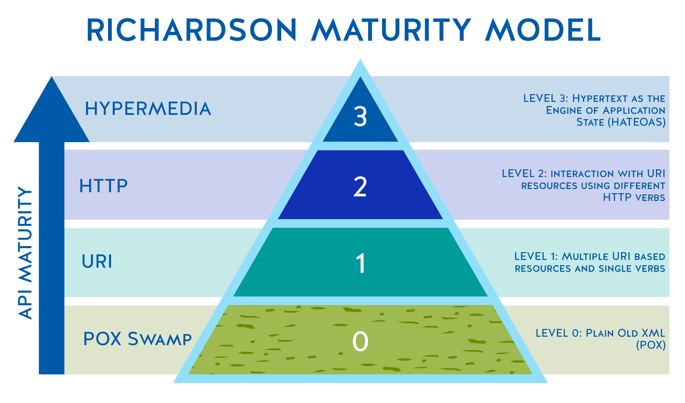

# restful-project
Spring Boot를 활용한 RESTful API 개발 예제

## REST Maturity Level

Rechardson이 설계한 REST 성숙도 모델에서는 REST API를 총 3단계로 구분한다.

Level 0 : REST를 전혀 고려하지 않은 단계

Level 1: URI를 구분하고 각 URI가 고유한 Resourse를 가리키며 단일 Status를 사용하는 단계

Level 2 : URI와 여러 개의 HTTP Method와 Status를 활용하는 단계

Level 3 : 초기 진입점 이후 API가 다음 동작에 대한 링크를 내포하여 모든 동작을 수행할 수 있는 단계

## 프로젝트 정보

### version

Java 16, Spring Boot 2.5.1, Maven 4.0.0

### dependency

spring-boot-starter-web,spring-boot-devtools, spring-boot-starter-data-jpa,

hibernate-validator 6.0.7.Final, h2, lombok, jackson-dataformat-xml 2.12.3,

springfox-boot-starter 3.0.0, spring-boot-starter-actuator,

spring-boot-starter-security 2.5.1, spring-data-rest-hal-browser 3.3.9.RELEASE

## 프로젝트 개요

RESTful API를 설계하고 개발하기 위하여 리차드슨의 REST 성숙도 모델을 참고했다.

3단계의 REST API를 개발하기 위하여 필요한 기술을 학습하고 실습해보았다.

## 개발 내용

1. Contoller - Service - Repository 계층 구조 구현
2. H2, Spring Data JPA를 활용한 도메인 클래스와 데이터베이스 매핑
3. POST, GET, PUT, DELETE 메소드를 활용한 REST API 개발
4. 예외를 ResponseEntityExceptionHandler에서 AOP로 처리 (다양한 Http Status 활용)
5. Swagger를 활용한 REST API 문서화
6. HATEOAS를 활용하여 link를 내포한 API 개발